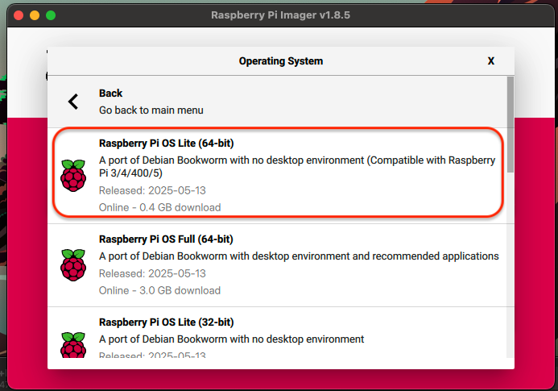
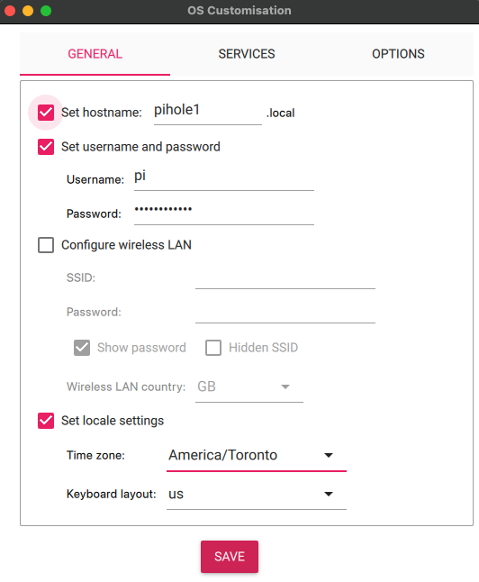
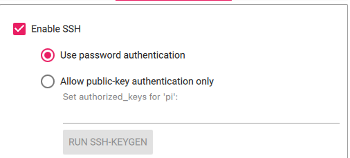
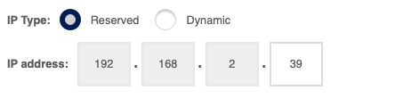
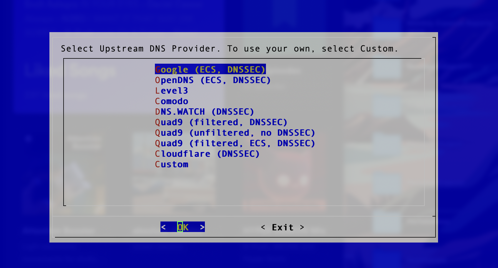
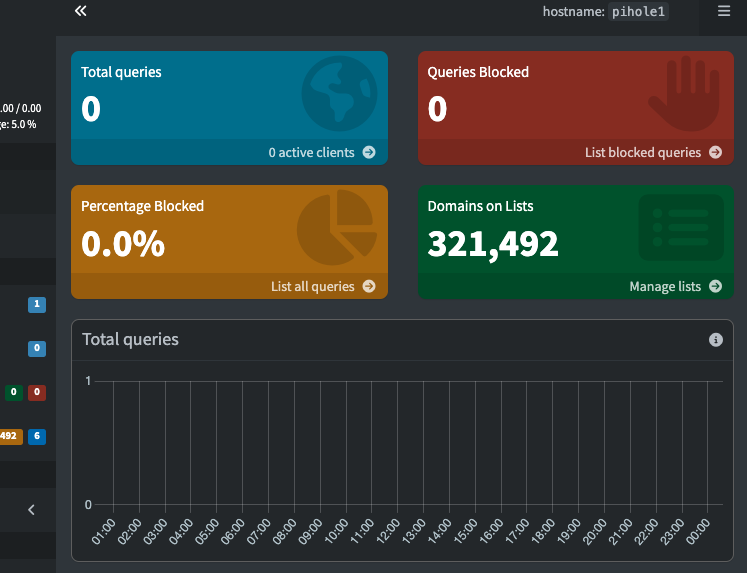

# DNS_Sinkhole

##  Raspberry Pi 4 – Pi-hole Setup (Headless with Static IP)

This guide walks through setting up a **headless Raspberry Pi 4** with **Raspberry Pi OS Lite** and installing **Pi-hole** for network-wide ad blocking. It includes setting a **static IP** and basic security hardening steps for use in your homelab.

---

##  1. Flash Raspberry Pi OS Lite to SD Card

Use **Raspberry Pi Imager** to flash **Raspberry Pi OS Lite** to your microSD card.

>  Choose "Raspberry Pi OS Lite (32-bit)" for a lightweight, terminal-only setup.



---

## ⚙️ 2. Configure Before Flashing

Before writing the image, click the **gear icon** (Advanced Settings) in Raspberry Pi Imager to configure:

- ✅ Set a hostname (e.g., `pihole1`)
- ✅ Enable SSH
- ✅ Set a custom username and **strong password**


  


---

##  3. Boot the Pi and Update the System

Insert the microSD into your Pi and power it on (via Ethernet or headless Wi-Fi config). Once it boots:

1. Find the device IP (see next step)  
2. Connect via SSH  
3. Update packages:

```bash
sudo apt update && sudo apt upgrade -y

##  4. Find the Device IP and SSH In

To connect to your Raspberry Pi, you’ll first need its IP address. You can find this by:

- Logging into your router's web interface
- Looking under the DHCP table or “Connected Devices”
- Identifying the Pi by the hostname you configured earlier (e.g., `pihole1`)

Once you find the IP, SSH into the Pi from another device:

```bash
ssh pi@192.168.2.39
# Replace with your actual Pi IP
```

Update the system:

```bash
sudo apt update && sudo apt upgrade -y
```

---

##  5. Set a Static IP

### Option A – Set a DHCP Reservation on Your Router

This is the easiest method. Most routers allow you to “reserve” the current IP address for your Raspberry Pi so it never changes.



### Option B – Set a Static IP on the Pi Itself

If your router doesn’t support DHCP reservations, configure a static IP on the Pi manually.

Edit the DHCP client config file:

```bash
sudo nano /etc/dhcp/dhclient.conf
```

Uncomment and edit relevant fields to set a static IP:

```conf
# send host-name "pihole1";
# fixed-address 192.168.2.39;
# option subnet-mask 255.255.255.0;
# option routers 192.168.2.1;
# option domain-name-servers 127.0.0.1;
```

Then reboot:

```bash
sudo reboot
```

---

##  6. Install Pi-hole

Install Pi-hole using the official installer script:

```bash
curl -sSL https://install.pi-hole.net | bash
```

During installation, you’ll be prompted to:

- Choose a network interface
- Confirm the static IP
- Select upstream DNS providers
- Enable or disable logging
- Set the web admin password

---

##  7. Understanding Upstream DNS Providers

When Pi-hole doesn’t recognize a DNS request (not cached or blocked), it forwards the request to a third-party **upstream DNS provider** such as:

- Cloudflare `1.1.1.1`
- Google `8.8.8.8`
- Quad9 `9.9.9.9`

These services resolve DNS queries on your behalf.



---

##  8. (Optional) Use Unbound for Recursive DNS

For increased privacy, you can configure **Unbound** on the Pi to perform recursive DNS resolution directly from root DNS servers, bypassing third parties.

Install Unbound:

```bash
sudo apt install unbound -y
```

Create and edit the config file:

```bash
sudo nano /etc/unbound/unbound.conf.d/pi-hole.conf
```

Use the [official Pi-hole guide](https://docs.pi-hole.net/guides/dns/unbound/) for a sample config.

Restart Unbound:

```bash
sudo service unbound restart
```

---

##  9. Access the Pi-hole Web Interface

Once setup is complete, access the Pi-hole dashboard from any browser on your local network:

- `http://pi.hole/admin`
- or `http://<your-static-ip>/admin`  

Login with the password you set during installation.

---

##  10. Change Admin Password (if needed)

To change the Pi-hole admin password:

```bash
sudo pihole set password
```

You can set a new password, or leave it blank to disable password protection (not recommended).

---

---

##  11. Set Pi-hole as Primary DNS on Your Router

To allow all devices on your network to use Pi-hole for DNS filtering:

1. Log in to your router’s admin interface.
2. Locate the **LAN DHCP settings** or **DNS settings**.
3. Set the **Primary DNS server** to your Pi-hole’s static IP address (e.g., `192.168.2.39`).
4. Optionally, leave the **Secondary DNS** blank or set to a public DNS (e.g., `1.1.1.1`) for failover — but note:
   - If you want **all** DNS traffic filtered through Pi-hole, leave the **Secondary DNS empty** or also set it to Pi-hole.

> 🔒 Some routers override custom DNS. You may also need to disable “DNS rebind protection” or similar if you get resolution errors.

Once done:
- All devices that receive IP configuration from the router will use Pi-hole for DNS.
- You can verify this by checking the Pi-hole dashboard (`http://<your-static-ip>/admin`) to see live queries.



---

